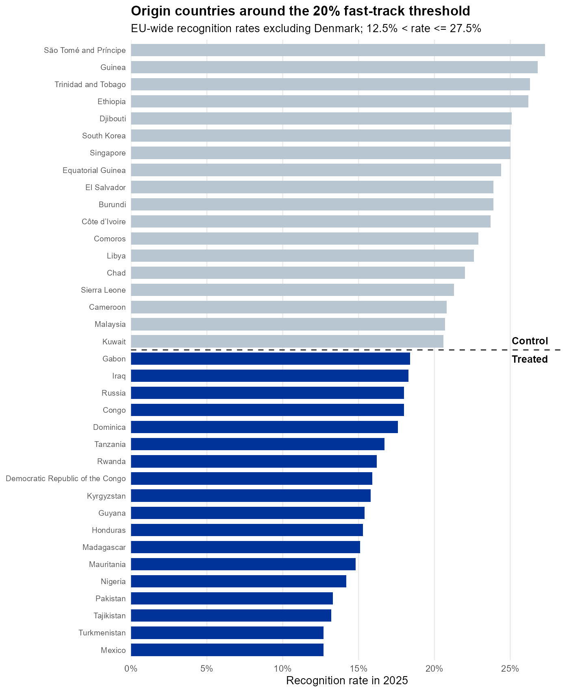

```{r}
#| label: setup
#| echo: false
results <- jsonlite::read_json("results_summary.json", simplifyVector = TRUE)
```

> **Preliminary.** Data through **`r results$data_vintage`**. Last successful update: **`r results$last_successful_update`**.

## Setting and research idea

Under the EU's new Asylum Procedure Regulation (2024/1348), applicants' claims are subject to an accelerated border examination  (max 12 weeks) whenever the prior-year recognition rate of applicants from the same origin country is 20% or lower, considerably shortening the proecedure. The rule creates a sharp, numerical, and publicly announced eligibility threshold: origins just below 20% face a faster procedure than origins just above it. This note tracks whether that eligibility change shifts the number of asylum applications from affected countroes. This allows us to study the effect of EU-wide policies on asylum applications, which typically can't be done; single-EU country policy evaluations on asylum applications can only identify relative effects because of diversion.  The rule entered into force June 2026, so everything shown here is still pre-policy: the exercise validates that treated and control origins were not already trending apart before the cutoff bites. 


## Research design

The note runs **two complementary designs** side by side. The first is a **difference-in-differences**: origins with a 2025 recognition rate between 12.5% and 20% (treated by the cutoff) are compared to origins between 20% and 27.5% (control), using a Poisson (PPML) event study with origin and quarter fixed effects. The second is a **dynamic difference-in-discontinuities**: at each quarterly horizon, it compares the change in EU-wide applications for origins just below the 20% cutoff against origins just above it, relative to the most recent (reference) quarter, using a fixed 20-percentage-point bandwidth with triangular-kernel local-linear and local-quadratic fits on each side. The first design is simpler and does not depend on local smoothing; the second uses a wider 0-40% support and treats the cutoff itself, rather than the 12.5-27.5% band, as the source of identification. Agreement between the two is a stronger pre-policy check than either alone. Data on applications and recognition rates originate from eurostat. 

<details><summary>Technical details</summary>

The running variable is the 2025 EU-wide recognition rate minus 20. The sample keeps origins with a 2025 recognition rate strictly above 12.5% and at or below 27.5%, and at least `r results$min_pretreatment_applications` EU-wide applications in 2025 (`r results$n_treated` treated, `r results$n_control` control origins as of this update). For quarterly horizon *l*, the outcome is the change in that origin's applications relative to the reference quarter *r* = `r results$reference_quarter`, normalized by the origin's average quarterly 2025 applications: `(Y_r - Y_l) / (Y_2025 / 4)` for horizons before the Pact's application date, and `(Y_l - Y_r) / (Y_2025 / 4)` for horizons at or after it -- so a pre-policy value above zero and a post-policy value above zero both read as movement in the same, policy-consistent direction. Both `Y_l` and `Y_r` are rescaled to a full-quarter-equivalent by `3 / months observed` whenever a quarter is incomplete, so a partial reference or partial current quarter is not mechanically under-counted relative to complete quarters. The PPML event study applies the same exposure adjustment as a regression offset, `log(months observed / 3)`, rather than rescaling counts directly. Standard errors are clustered by origin country throughout. The data vintage advances automatically to the latest month for which at least `r 100 * results$min_reporting_coverage`% of EU Member States have reported any observations, so the sample window, quarter count, and axis extent all update on their own as new Eurostat releases arrive -- nothing here is pinned to a calendar date except the Pact's own June 2026 entry into force.

</details>

## Preliminary results

@fig-cutoff shows where the `r results$n_treated + results$n_control` origins in the 12.5-27.5% window actually sit relative to the 20% cutoff -- the dashed line marks the threshold, with treated origins (accelerated) below it and control origins above it. @fig-trends plots the raw monthly application totals for the two groups; both have been drifting down over 2025-26 without an obvious break yet, but volumes and composition differ, so this alone is not evidence of parallel trends. @fig-ppml is the difference-in-differences design's quarter-fixed-effects event study: the treated-control gap is close to zero in every pre-reference quarter and never statistically distinguishable from it. @fig-rdd is the dynamic difference-in-discontinuities design's main estimate, plotted on the same y-axis scale as @fig-ppml for direct comparison: linear and quadratic fits agree that the gap has been converging toward zero as the reference quarter approaches, with wide, overlapping confidence bands throughout.

<details><summary>Figure 1: origin countries around the 20% cutoff</summary>

{#fig-cutoff}

</details>

{#fig-trends}

{#fig-ppml}

{#fig-rdd}

<details><summary>Explainer: what's behind Figure 4 (the local RDD fits)</summary>

Each panel of the figure below is one quarterly horizon's cutoff comparison: origin-level normalized changes plotted against the 2025 recognition rate, with application-weighted bins and the triangular-kernel linear/quadratic fits that @fig-rdd summarizes into a single treated-minus-control estimate per quarter. It's the diagnostic view behind the headline numbers, useful for checking that no single origin or outlier is driving a quarter's estimate.

{#fig-rdd-panels}

</details>

## Conclusion

With `r results$n_treated` treated and `r results$n_control` control origins, the event study design has reasonable power: the most recent complete pre-reference quarter's PPML estimate is `r results$latest_pretrend_estimate` (SE `r results$latest_pretrend_se`). Because PPML is a log-linear model, that estimate reads on the percentage scale as a `r sprintf("%.1f", (exp(results$latest_pretrend_estimate) - 1) * 100)`% pre-trend (95% CI `r sprintf("%.1f", (exp(results$latest_pretrend_estimate - 1.96 * results$latest_pretrend_se) - 1) * 100)`% to `r sprintf("%.1f", (exp(results$latest_pretrend_estimate + 1.96 * results$latest_pretrend_se) - 1) * 100)`%) -- small enough to detect a moderate-sized effect, so the PPML design should have real power to pick up a genuine fast-track deterrent once post-policy data arrive. The dynamic difference-in-discontinuities estimates are far more imprecise, so most of that power comes from the PPML side rather than the RDD one, even though the RDD is arguably better identified. However, as every year in January the recognition rates list updates, every january becomes a new natural experiment, which will allow us to gradually build evidence, as some treated countries become control and vice versa. Let the data flow in!

<details><summary>How this page updates itself</summary>

Once a month, a GitHub Actions workflow checks Eurostat's bulk data files for a new release, reruns the versioned R analysis script (`update.R`), and re-renders this Quarto note. If the new data pass validation -- enough Member States reporting, no broken joins -- the workflow commits the refreshed figures, results, and this page straight to the repository, and GitHub Pages serves the update automatically. Nothing here is edited by hand: the same code that produced the numbers above produces every future update, and the full history of past versions stays visible in the repository's commit log.

</details>

---

**Sources:** [Eurostat `migr_asydec1pc`](https://ec.europa.eu/eurostat/databrowser/product/view/migr_asydec1pc) (first-instance decisions) · [Eurostat `migr_asyappctzm`](https://ec.europa.eu/eurostat/databrowser/product/view/migr_asyappctzm) (first-time applications) · **Code:** [update.R](https://github.com/JopieAdema/JopieAdema.github.io/blob/master/living-research/eu-migration-pact/update.R) · **Contact:** [j.a.h.adema94@gmail.com](mailto:j.a.h.adema94@gmail.com)
