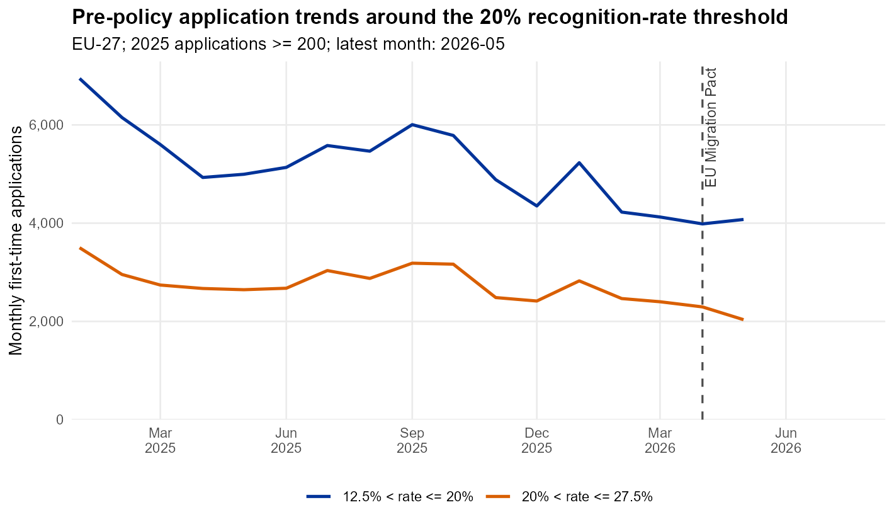
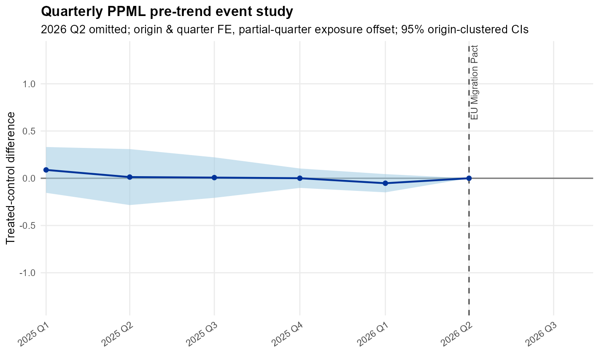
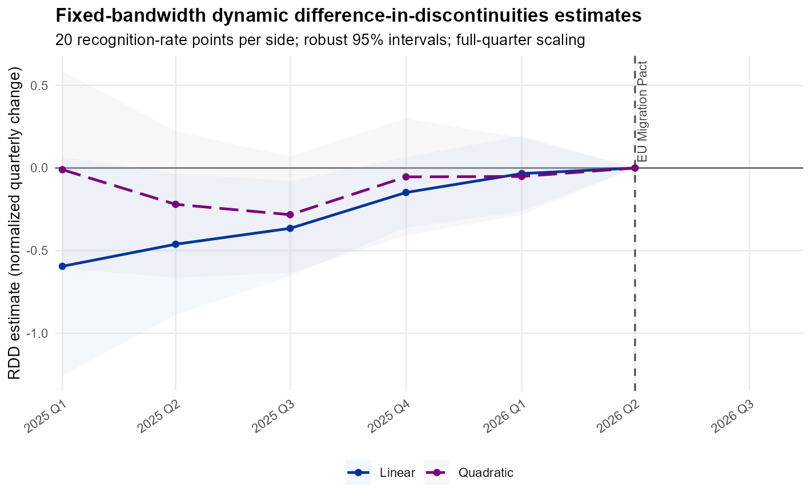
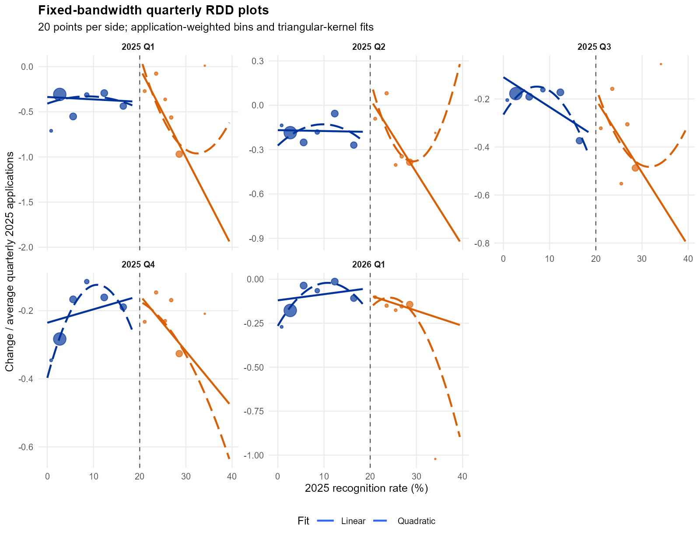

```{r}
#| label: setup
#| echo: false
results <- jsonlite::read_json("results_summary.json", simplifyVector = TRUE)
```

> **Preliminary.** Data through **`r results$data_vintage`**. Last successful update: **`r results$last_successful_update`**.

## Setting and research idea

Under the EU's new Asylum Procedure Regulation (2024/1348), a nationality group is routed into accelerated examination whenever its EU-wide, prior-year recognition rate is 20% or lower. The rule creates a sharp, numerical, and publicly announced eligibility threshold: origins just below 20% face a faster, more precarious procedure than origins just above it. This note tracks whether that eligibility change shifts how many people apply, when they apply, and where in the EU they apply -- three behavioral responses (deterrence, timing, and diversion) that a single-country policy evaluation cannot separate, because it cannot tell a reduction in arrivals from relocation to a neighboring destination. Because the rule applies EU-wide, aggregate EU applications are largely robust to within-EU diversion by construction, turning that usual confound into a directly testable, secondary outcome. The rule enters into application in Q2 2026, so everything shown here is still pre-policy: the exercise validates that treated and control origins were not already trending apart before the cutoff bites.

## Research design

The design is a **dynamic difference-in-discontinuities**: at each quarterly horizon, it compares the change in EU-wide applications for origins just below the 20% cutoff against origins just above it, relative to the most recent (reference) quarter, using a fixed 20-percentage-point bandwidth with triangular-kernel local-linear and local-quadratic fits on each side. A complementary Poisson (PPML) event study with origin and quarter fixed effects checks the same pre-trend without relying on local smoothing.

<details><summary>Technical details</summary>

The running variable is the 2025 EU-wide recognition rate minus 20. The sample keeps origins with a 2025 recognition rate strictly above 12.5% and at or below 27.5%, and at least `r results$min_pretreatment_applications` EU-wide applications in 2025 (`r results$n_treated` treated, `r results$n_control` control origins as of this update). For quarterly horizon *l*, the outcome is the change in that origin's applications relative to the reference quarter *r* = `r results$reference_quarter`, normalized by the origin's average quarterly 2025 applications: `(Y_r - Y_l) / (Y_2025 / 4)` for horizons before the Pact's application date, and `(Y_l - Y_r) / (Y_2025 / 4)` for horizons at or after it -- so a pre-policy value above zero and a post-policy value above zero both read as movement in the same, policy-consistent direction. Both `Y_l` and `Y_r` are rescaled to a full-quarter-equivalent by `3 / months observed` whenever a quarter is incomplete, so a partial reference or partial current quarter is not mechanically under-counted relative to complete quarters. The PPML event study applies the same exposure adjustment as a regression offset, `log(months observed / 3)`, rather than rescaling counts directly. Standard errors are clustered by origin country throughout. The data vintage advances automatically to the latest month for which at least `r 100 * results$min_reporting_coverage`% of EU Member States have reported any observations, so the sample window, quarter count, and axis extent all update on their own as new Eurostat releases arrive -- nothing here is pinned to a calendar date except the Pact's own Q2 2026 application date.

</details>

## Preliminary results

@fig-trends plots the raw monthly application totals for the two groups; both have been drifting down over 2025-26 without an obvious break yet, but volumes and composition differ, so this alone is not evidence of parallel trends. @fig-ppml is the quarter-fixed-effects event study: the treated-control gap is close to zero in every pre-reference quarter and never statistically distinguishable from it. @fig-rdd is the main dynamic difference-in-discontinuities estimate: linear and quadratic fits agree that the gap has been converging toward zero as the reference quarter approaches, with wide, overlapping confidence bands throughout.

{#fig-trends}

{#fig-ppml}

{#fig-rdd}

<details><summary>Explainer: what's behind Figure 3 (the local RDD fits)</summary>

Each panel of the figure below is one quarterly horizon's cutoff comparison: origin-level normalized changes plotted against the 2025 recognition rate, with application-weighted bins and the triangular-kernel linear/quadratic fits that @fig-rdd summarizes into a single treated-minus-control estimate per quarter. It's the diagnostic view behind the headline numbers, useful for checking that no single origin or outlier is driving a quarter's estimate.

{#fig-rdd-panels}

</details>

## Conclusion

With `r results$n_treated` treated and `r results$n_control` control origins, this design has limited power: the most recent complete pre-reference quarter's PPML estimate is `r results$latest_pretrend_estimate` (SE `r results$latest_pretrend_se`), a confidence interval wide enough to miss all but a large treated-control divergence. That is the right benchmark for reading every figure above -- a flat pre-trend here is consistent with parallel trends, but it is also consistent with a moderate divergence the sample is simply not powered to detect. The way forward is mechanical rather than exploratory: once Q2 2026 and later data clear the `r 100 * results$min_reporting_coverage`% reporting-coverage bar, the last uncontaminated pre-policy quarter freezes as the reference, the same specification re-estimates the post-cutoff break, and this page updates automatically. Until then, this note exists to make that pre-policy validation step -- and any future revision to it -- fully public and reproducible as the data arrive.

---

**Sources:** [Eurostat `migr_asydec1pc`](https://ec.europa.eu/eurostat/databrowser/product/view/migr_asydec1pc) (first-instance decisions) · [Eurostat `migr_asyappctzm`](https://ec.europa.eu/eurostat/databrowser/product/view/migr_asyappctzm) (first-time applications) · **Code:** [update.R](https://github.com/JopieAdema/JopieAdema.github.io/blob/master/living-research/eu-migration-pact/update.R) · **Contact:** [j.a.h.adema94@gmail.com](mailto:j.a.h.adema94@gmail.com)
